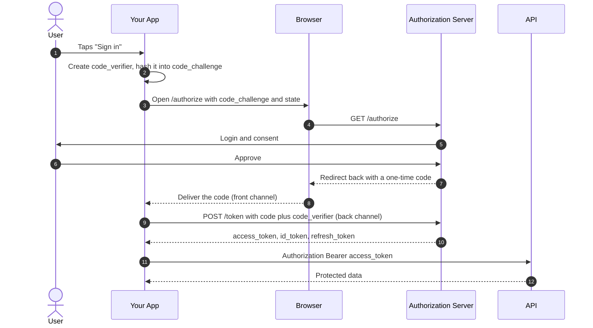

<div align="center">

# OAuth 2.0 & OpenID Connect

**A plain-English reference for the two protocols behind every "Sign in with…" button.**

[](https://www.rfc-editor.org/rfc/rfc6749)
[](https://openid.net/specs/openid-connect-core-1_0.html)
[](https://www.rfc-editor.org/rfc/rfc9700)
[](https://kotlinlang.org)
[](https://developer.android.com)

**[📖 Read the full overview →](OVERVIEW.md)**  ·  **[▶ Run the demo app →](#the-demo-app)**

*Includes a working Android app that runs a real PKCE flow and shows you every value it produces.*

</div>

---

## The 60-second version

**OAuth 2.0 is a valet key for APIs.** Instead of giving an app your password, you give it a token
that is scoped (only certain permissions), temporary (expires soon), and revocable (cancel it without
changing your password).

**OAuth is not login.** An access token says *what an app may do*, not *who you are*. Using one to
identify a user is a real vulnerability, not just a style issue — a malicious app can hand your app a
token it obtained itself and get logged in as someone else.

**OpenID Connect is the login layer.** It adds one thing to OAuth: a signed **ID token** that proves
*this specific user just authenticated, and this statement was minted for your app, in response to
your request*. That last part is what makes it safe when a bare access token isn't.

> **OAuth answers "what can this app do?" · OIDC answers "who is this user?"**

**There is one flow you should use:** Authorization Code + PKCE. Everything else is either a special
case or deprecated.

---

## The one diagram



**Why the two-step dance?** The browser (the "front channel") is a leaky place — URLs land in
history, logs, and address bars, and on mobile another app might have claimed your redirect URI. So
only a **one-time code** travels through it. That code is useless alone; it must be redeemed over a
direct HTTPS call (the "back channel") along with proof that you're the app that started the flow.
Tokens never touch the browser.

---

## Cheat sheet

### Know your three tokens

| Token | Answers | Who reads it | Life | Send it to |
|---|---|---|---|---|
| **Access** | "May the bearer do this?" | The **API** | Minutes–1 hour | Resource servers |
| **ID** | "Who logged in?" | **Your app** | Minutes | Nobody |
| **Refresh** | "May I have a new access token?" | The **auth server** | Days–months | Token endpoint only |

Don't send an ID token to an API. Don't try to parse an access token in your client — it's opaque to
you by design.

### Three random values, three different jobs

| | Protects against | The question it answers | Checked by |
|---|---|---|---|
| `state` | CSRF | "Is this a response to a request *I* started?" | Your app |
| `nonce` | ID token replay | "Was this token minted for *this* request?" | Your app |
| `code_verifier` | Code interception | "Am I the app that *started* this flow?" | The auth server |

### The rules

✅ **Do**

- Use **Authorization Code + PKCE** — for every client type, including server-side ones
- Use `code_challenge_method=S256`, never `plain`
- Validate the ID token: **signature**, `iss`, `aud`, `exp`, `nonce`, and an `alg` allowlist
- Use **`(iss, sub)`** as the user's primary key — not their email address
- Match redirect URIs **exactly**; no wildcards, no prefix matching
- Keep access tokens short-lived and rotate refresh tokens
- Request the **minimum scopes**, at the moment you need them
- Use a well-maintained library

❌ **Don't**

- Ship a **client secret** in a mobile app or SPA — an APK is a zip file
- Use the **implicit** or **password (ROPC)** grants — both removed in OAuth 2.1
- Use a **WebView** for login — breaks SSO and password managers, exposes credentials, and is
  blocked by Google and Microsoft
- Put access tokens in **URLs** — they leak into logs and `Referer` headers
- **Decode** a JWT and call it validated
- Treat **scopes as a permission system** — your API still owes its own authorization checks

[→ Full list of common mistakes, with explanations](OVERVIEW.md#16-common-mistakes)

### Vocabulary in one line each

| Term | Meaning |
|---|---|
| **Resource Owner** | The user who owns the data |
| **Client** | The app asking for access |
| **Authorization Server** | Issues the tokens; runs login and consent |
| **Resource Server** | The API that accepts the tokens |
| **Public client** | Can't keep a secret — mobile, SPA, desktop |
| **Confidential client** | Can keep a secret — runs on your server |
| **Front channel** | Through the browser via redirects. Never send tokens here. |
| **Back channel** | Direct HTTPS. Safe for tokens. |
| **Bearer token** | Whoever holds it can use it — protect it like a password |
| **`sub`** | The stable, unique user ID |
| **JWKS** | The auth server's published public keys, for verifying signatures |

[→ Full glossary](OVERVIEW.md#17-glossary)

---

## Read the overview

**[OVERVIEW.md](OVERVIEW.md)** is the guided walkthrough — analogies first, protocol details second,
with real HTTP requests and responses throughout.

| | | |
|---|---|---|
| [1. The problem OAuth solves](OVERVIEW.md#1-the-problem-oauth-solves) | [7. PKCE](OVERVIEW.md#7-pkce--the-part-you-must-not-skip) | [13. Refresh, expiry, logout](OVERVIEW.md#13-refresh-expiry-and-logout) |
| [2. The cast of characters](OVERVIEW.md#2-the-cast-of-characters) | [8. The other grant types](OVERVIEW.md#8-the-other-grant-types) | [14. Scopes and audiences](OVERVIEW.md#14-scopes-audiences-and-claims) |
| [3. OAuth is not login](OVERVIEW.md#3-oauth-is-not-login--openid-connect-is) | [9. OpenID Connect on top](OVERVIEW.md#9-openid-connect-on-top) | [15. Doing this on Android](OVERVIEW.md#15-doing-this-on-android) |
| [4. The three tokens](OVERVIEW.md#4-the-three-tokens) | [10. Anatomy of an ID token](OVERVIEW.md#10-anatomy-of-an-id-token) | [16. Common mistakes](OVERVIEW.md#16-common-mistakes) |
| [5. Front vs. back channel](OVERVIEW.md#5-front-channel-vs-back-channel) | [11. `state` vs `nonce` vs `code_verifier`](OVERVIEW.md#11-state-vs-nonce-vs-code_verifier) | [17. Glossary](OVERVIEW.md#17-glossary) |
| [6. The Authorization Code flow](OVERVIEW.md#6-the-authorization-code-flow-step-by-step) | [12. Validating tokens](OVERVIEW.md#12-validating-tokens) | [18. Spec map](OVERVIEW.md#18-spec-map) |

**Start with §3, §5, and §11.** Those three carry most of the conceptual weight — the rest is
mechanics that follow from them.

---

## On Android specifically

The rules tighten on mobile, because your app is a **public client**: it can't keep a secret, and it
runs on a device you don't control. The governing spec is
[RFC 8252, *OAuth 2.0 for Native Apps*](https://www.rfc-editor.org/rfc/rfc8252).

| | |
|---|---|
| **Browser** | **Custom Tabs** (`androidx.browser`). Never a `WebView` — it can read the user's password, has its own cookie jar (so no SSO), and breaks password managers and passkeys. |
| **Client secret** | None. Register as a public client; PKCE replaces the secret. |
| **PKCE** | Mandatory. Another app can register your custom URI scheme, so a stolen code must be unusable. |
| **Redirect URI** | Custom scheme (`com.rick.oauthopenid://oauth2redirect`) is simplest; **App Links** over HTTPS are stronger since Android verifies the domain. |
| **Token storage** | Not plain `SharedPreferences`. Note `EncryptedSharedPreferences` is now **deprecated** — the current stack is **DataStore + Tink**, keyed by the **Android Keystore**. Exclude it from backup. |
| **Library** | [AppAuth-Android](https://github.com/openid/AppAuth-Android) is the reference implementation, but check its status first — last release was 0.11.1 in Dec 2021 and it has a large open backlog. Your IdP's own SDK, or **Credential Manager** for Sign in with Google, may be a better fit. |

[→ Android details, with manifest and Kotlin snippets](OVERVIEW.md#15-doing-this-on-android)

---

## Specs worth knowing

Verified current as of **September 2026**.

| Spec | What it is |
|---|---|
| [RFC 6749](https://www.rfc-editor.org/rfc/rfc6749) | OAuth 2.0 core |
| [RFC 6750](https://www.rfc-editor.org/rfc/rfc6750) | Bearer token usage |
| [RFC 7636](https://www.rfc-editor.org/rfc/rfc7636) | PKCE |
| [OIDC Core 1.0](https://openid.net/specs/openid-connect-core-1_0.html) | The identity layer |
| **[RFC 9700](https://www.rfc-editor.org/rfc/rfc9700)** | **OAuth 2.0 Security BCP** (BCP 240, Jan 2025) — the modern security baseline |
| [RFC 8252](https://www.rfc-editor.org/rfc/rfc8252) | OAuth for **Native Apps** (BCP 212) |
| [RFC 10017](https://www.rfc-editor.org/rfc/rfc10017) | OAuth for **Browser-Based Apps** (BCP 212, Aug 2026) |

**If you read only one, read [RFC 9700](https://www.rfc-editor.org/rfc/rfc9700).** It's 46 pages and
consolidates everything the ecosystem learned since 2012.

**What about OAuth 2.1?** Still an [Internet-Draft](https://datatracker.ietf.org/doc/draft-ietf-oauth-v2-1/)
(revision 16, September 2026), not an RFC — the working group aims to submit it to the IESG by
December 2026. It's a cleanup, not a new protocol: it folds OAuth 2.0 + PKCE + the security BCP into
one document, requires PKCE everywhere, removes the implicit and password grants, and mandates exact
redirect URI matching. Follow RFC 9700 today and you're already there.

[→ Extensions: DPoP, PAR, introspection, device grant, and more](OVERVIEW.md#common-extensions)

---

## The demo app

The `app/` module runs a **real** Authorization Code + PKCE flow against a **real** OpenID Connect
provider, and shows you every value the protocol produces as it happens.

Each of the eight steps expands to reveal what actually went over the wire — the `code_verifier` and
the challenge derived from it, the full authorization URL, the one-time code coming back, the raw
token response, the decoded ID token, and a per-claim validation checklist.

| Step | What you see |
|---|---|
| 1 | The provider's discovery document, fetched live |
| 2 | The generated `code_verifier`, `code_challenge`, `state`, and `nonce` |
| 3 | The exact `/authorize` URL, opened in Custom Tabs |
| 4 | The returned code, and the `state` comparison that guards it |
| 5 | The token response, fetched over the back channel |
| 6 | The ID token decoded — readable by anyone, trusted by nobody yet |
| 7 | Signature verified against the provider's JWKS, then every claim checked |
| 8 | A protected API call with `Authorization: Bearer` |

### Running it

No setup, no signup, no client registration:

```bash
./gradlew installDebug        # macOS / Linux
.\gradlew.bat installDebug    # Windows
```

It's preconfigured against [Duende's public demo IdentityServer](https://demo.duendesoftware.com).
Sign in as **`alice` / `alice`** or **`bob` / `bob`**. You can point it at your own provider by
editing the issuer, client ID, and scopes in the app's Provider card — discovery handles the rest.

> **Two things about the demo that aren't how you should build.** The demo server accepts *any*
> redirect URI for its sample clients so that any sample app can test against it; a real
> authorization server must match redirect URIs exactly. And the flow here is hand-written so every
> step is readable — production apps should use a maintained library, because the details that are
> easy to skip are the ones that become vulnerabilities.

### What to read in the code

| File | Why it's interesting |
|---|---|
| [`Pkce.kt`](app/src/main/java/com/rick/oauthopenid/oauth/Pkce.kt) | The whole of PKCE, in about ten lines |
| [`OidcClient.kt`](app/src/main/java/com/rick/oauthopenid/oauth/OidcClient.kt) | Discovery, the authorize URL, and both token grants |
| [`IdTokenValidator.kt`](app/src/main/java/com/rick/oauthopenid/oauth/IdTokenValidator.kt) | Every check, including real RS256 verification against the JWKS |
| [`OAuthProtocolTest.kt`](app/src/androidTest/java/com/rick/oauthopenid/OAuthProtocolTest.kt) | Proves the validator *rejects* tampered, replayed, and misaddressed tokens |

---

## About this repo

A study reference for OAuth 2.0 and OpenID Connect, grounded in the constraints of a real public
client rather than generic theory.

```
├── README.md                     ← you are here: quick reference
├── OVERVIEW.md                   ← the full walkthrough
└── app/src/
    ├── main/java/com/rick/oauthopenid/
    │   ├── MainActivity.kt        ← Custom Tabs launch + redirect handling
    │   ├── oauth/                 ← the protocol, ~500 readable lines
    │   └── ui/                    ← the step-by-step Compose screen
    └── androidTest/               ← tests for the security-critical parts
```

### Building

Requires JDK 11+ and the Android SDK (compileSdk 37). Open the folder in Android Studio, or:

```bash
./gradlew assembleDebug           # build
./gradlew connectedAndroidTest    # run the protocol tests on a device
```

| | |
|---|---|
| Language | Kotlin 2.2.10 |
| UI | Jetpack Compose (BOM 2026.02.01), Material 3 |
| Build | AGP 9.3.2, Gradle version catalogs |
| SDK | minSdk 24 · targetSdk 37 · compileSdk 37 |

> No `LICENSE` file yet — add one before making this repository public.
